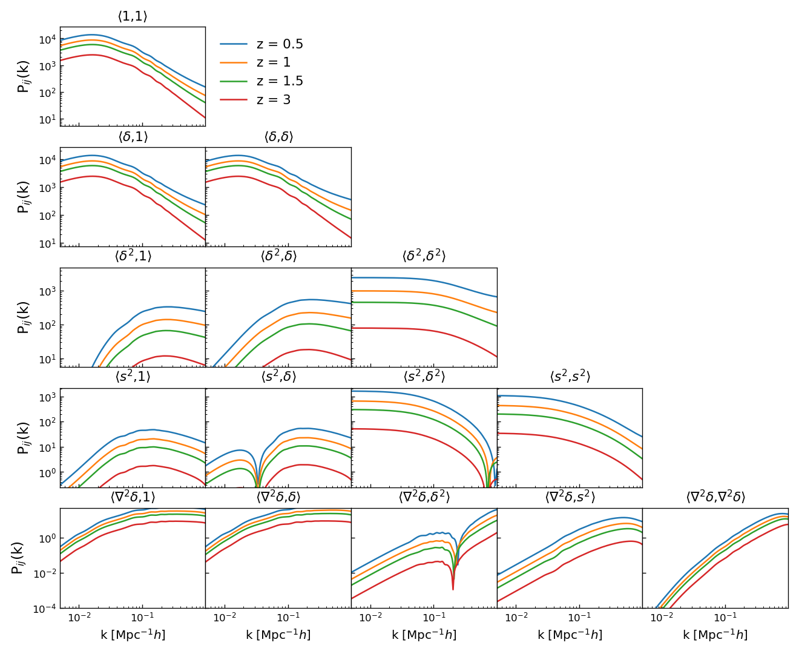

## CSSTLaB : <ins>C</ins>hina <ins>S</ins>pace <ins>S</ins>tation <ins>T</ins>elescope Hybrid <ins>La</ins>grangian <ins>B</ins>ias Expansion Emulator

A Python package for emulation of Lagrangian basis spectra within the EFTofLSS model. The emulator utilizes the hybrid Lagrangian bias expansion framework to model the biased tracer clustering. This is galaxy clustering extension of the [CSST emulator series](https://github.com/czymh/csstemu), for the theoretical supporting of the upcoming China Space Station Telescope galaxy survey.

Currently, the emulator allows the biased tracer power spectrum prediction in one percent level accuracy. It covers wavelength scale $0.001 \leq k \leq 1.0 \,h/{\rm Mpc}$ and redshift range $0\leq z\leq 3$, combining 1-loop theoretical results in linear region and simulation measurements in non-linear region. More technical details can be found in the [arXiv paper](https://arxiv.org/abs/2506.04671). Two emulator versions are provided, 
* [./csstlab](./csstlab) : `Numpy` & `Scipy` implementation of the emulation. 
* [./csstlab_jax](./csstlab_jax) : `JAX` implementation of the emulation, allowing auto-differentiation. Additionally depend on  [interpax](https://github.com/f0uriest/interpax) for interpolation with `Jax`. 


## Feature

* User-friendly, with simple interface and easy-to-use API. All the time-consuming parts have been done and stored,  without any other dependencies or compilation requirement. 
* Fast and efficient, with the speed of $\mathcal{O}(10^{-2})$ seconds to generate all the Lagrangian basis spectra for a given cosmology. 
* Differentiation emulation. We provide a `JAX` implementation of the emulator, allowing predication of the power spectrum derivative with respect to cosmological parameters. 
* Emulation with neutrino mass the dynamical dark energy $w_0w_a$. The training set [Kun suite](https://kunsimulation.readthedocs.io/en/latest/) simulates over cosmological parameter space 

<div align="center">

| Parameter | $\Omega_b$ | $\Omega_{cb}$ | $H_0$ | $n_s$ | $10^{9}A_s$ | $w_0$ | $w_a$ | $\sum M_{\nu}$ |
| ------------------ | ---------- | ------------- | ----- | ----- | ------------------ | ----- | ----- | --------------- |
| **Low**    | 0.04       | 0.24          | 60    | 0.92  | 1.7                | -1.3  | -0.5  | 0               |
| **High**    | 0.06       | 0.40          | 80    | 1.00  | 2.5                | -0.7  | 0.5   | 0.3             |
</div>


## Installation

Installation via `pip`
```bash
pip install -v git+https://github.com/ShurenZhou1999/csstlab
```
or direct `git clone` to use the auto-differentiation version.
```bash
git clone https://github.com/ShurenZhou1999/csstlab
```


## Quick Start

```python
from csstlab import Emulator, EFTofLSS_Model
emu = Emulator()
```
For the default $(k, z)$ bins, the emulator takes about $20ms$ to generate the basis spectra for one cosmology. More time is required if one want to sample more fine $(k, z)$ bins.
```python
import numpy as np

## set the (k, z) bins for the emulator
k = np.logspace(-3, 0, 200)     # unit : [h/Mpc]
z = [0.5, 1, 1.5, 3]
emu.set_k_and_z(k, z) 

# [Omega_b, Omega_m, h, n_s, 1e9 A_s, w_0, w_a, M_\nu ]
params = [ 0.048, 0.31, 0.67, 0.9665, 2.105, -0.9, 0.1, 0.03, ]
Pk_ij = emu(params)      ## 1 line to generate all basis spectra. It takes about 10 ~ 20 ms .
```

The basis spectra for first 5 Lagrangian basis fields, $1$, $\delta$, $\delta^2$, $s^2$ and $\nabla^2\delta$. 



Given a set of bias parameters, we can combine the basis spectra to biased tracer spectra. 
```python
alpha = 1.03         # shot noise amplitude
bias = [ 0.32, -0.43, -0.14, -0.14, ]       # b_1, b_2, b_s, b_\nabla
n_g = 0.5e-4      # number density of galaxies, unit : [h^3/Mpc^3]
IndexZ = 0        # redshift bin
pk_auto, pk_cross = EFTofLSS_Model.biased_spectra( k, Pk_ij[IndexZ], bias[1:] )
pk_auto += bias[0] *pk_shot

# plt.loglog( k, pk_hh, label="$P_{hh}$" )
# plt.loglog( k, pk_hm, label="$P_{hm}$" )
```
More examples can be found in the [notebook](./demo/demo.ipynb). For the `JAX` implementation, refer to [notebook-jax](./demo/demo_jax.ipynb).


## Acknowledgements

For any question, contact me at <zhoushuren@sjtu.edu.cn>.

