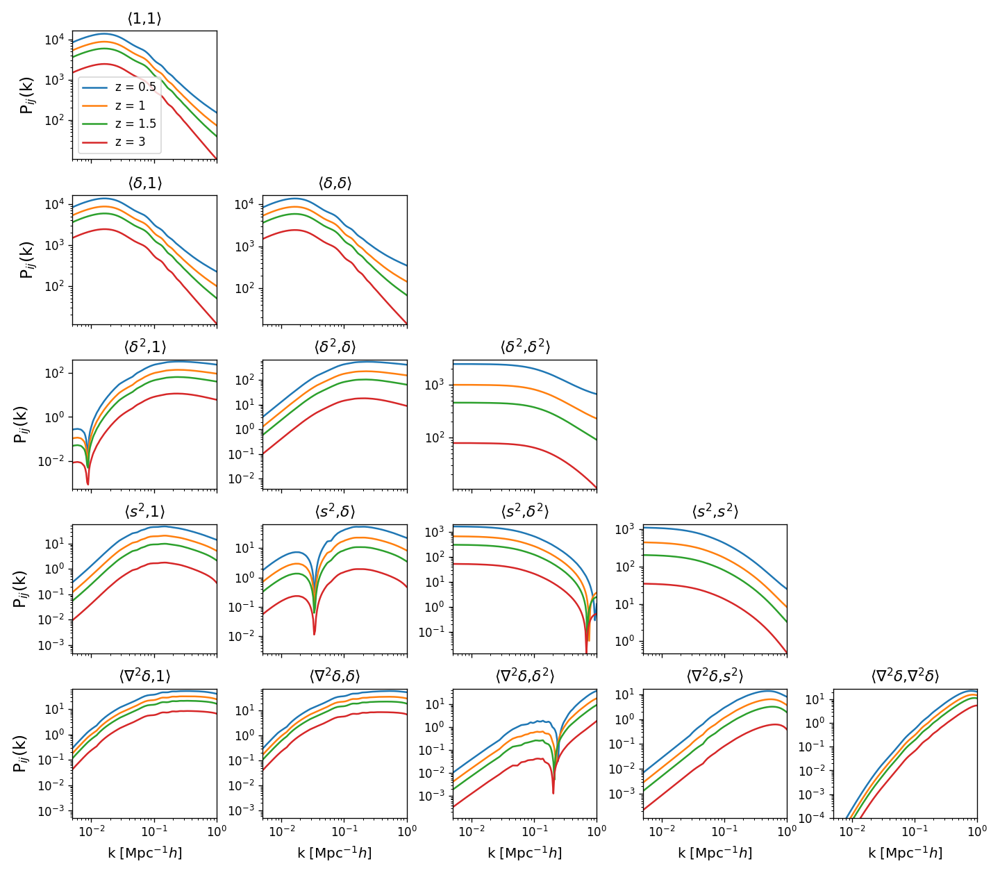

## CSSTLaB : <ins>C</ins>hina <ins>S</ins>pace <ins>S</ins>tation <ins>T</ins>elescope Hybrid <ins>La</ins>grangian <ins>B</ins>ias Expansion Emulator

A Python package for emulation of Lagrangian basis spectra within the EFTofLSS model. The emulator utilizes the hybrid Lagrangian bias expansion framework to model the biased tracer clustering. This is galaxy clustering extension of the CSST emulator series, preparing the theoretical supporting for the upcoming China Space Station Telescope galaxy survey.

Currently, the emulator allows predicting the biased tracer power spectrum in $1\%$ level accuracy. It covers wavelength scale $0.001 \leq k \leq 1.0\,{\rm Mpc}^{-1}h$ and redshift range $0\leq z\leq 3$, combining 1-loop theoretical results in linear region and simulation measurements in non-linear region. The details of training samples are same as the main branch [CSST emulator](https://github.com/czymh/csstemu). 


## Feature

* User-friendly, with simple interface and easy-to-use API. It only relies on the external libraries `Numpy` and `Scipy`, without any other dependencies or compilation requirement. All the time-consuming parts have been done and stored. 
* Fast and efficient, with the speed of $\mathcal{O}(10^{-2})$ seconds to generate all the Lagrangian basis spectra for a given cosmology. For arbitrary $(k, z)$ bins, it takes $\mathcal{O}(10^{-1})$ seconds to interpolate the all the basis spectra.
* Emulation with neutrino mass the dynamical dark energy $w_0w_a$. The training set [Kun suite](https://kunsimulation.readthedocs.io/en/latest/) simulates over cosmological parameter space 

| Parameter | $\Omega_b$ | $\Omega_{cb}$ | $H_0$ | $n_s$ | $10^{9}A_s$ | $w_0$ | $w_a$ | $\sum M_{\nu}$ |
| ------------------ | ---------- | ------------- | ----- | ----- | ------------------ | ----- | ----- | --------------- |
| **Low**    | 0.04       | 0.24          | 60    | 0.92  | 1.7                | -1.3  | -0.5  | 0               |
| **High**    | 0.06       | 0.40          | 80    | 1.00  | 2.5                | -0.7  | 0.5   | 0.3             |

* Current emulation supports the biased tracer power spectrum in real space. More details can be found in the upcoming paper. 


## Quick Start
After importing the library, you can load the emulator in one line Python code, with initialization time $\sim 0.1 s$. 
```python
from csstlab import Emulator, EFTofLSS_Model
emu = Emulator()
```
For the default $(k, z)$ bins, the emulator takes about $20ms$ to generate the basis spectra for one cosmology. More time is required if one want to sample more fine $(k, z)$ bins.
```python
import numpy as np

## set the (k, z) bins for the emulator
k = np.logspace(-3, 0, 200)     # unit : [h/Mpc]
z = [0.5, 1, 1.5, 3]
emu.set_k_and_z(k, z) 

# [Omega_b, Omega_m, h, n_s, 1e9 A_s, w_0, w_a, M_\nu ]
params = [ 0.048, 0.31, 0.67, 0.9665, 2.105, -0.9, 0.1, 0.03, ]
Pk_ij = emu(params)      ## 1 line to generate all basis spectra, ~ 20 ms
```

Here we show the basis spectra for first 5 Lagrangian basis fields, $1, \delta, \delta^2, s^2 $ and $\nabla^2\delta$. 
```python
import matplotlib.pyplot as plt

labels = [ "1", r"$\delta$", r"$\delta^2$", r"$s^2$", r"$\nabla^2\delta$", r"$\delta^3$", ]
n = 5
fig, axes = plt.subplots(n, n, dpi=120, figsize=(12, 10.5), sharex=True, )
ipk = -1
for j in range(n+1):
    for i in range(n+1):
        if i==n or j==n : ipk+=1; continue
        if i < j: axes[i,j].axis('off') ; continue
        ipk += 1
        for iz in range(4):
            axes[i,j].loglog( k, np.abs(Pk_ij[ipk, iz,]), c=f"C{iz}", label=f"z = {z[iz]}" )
        vmin, vmax = np.abs(Pk_ij[ipk]).min(), np.abs(Pk_ij[ipk]).max()
        axes[i,j].set_title( f'⟨{labels[i]},{labels[j]}⟩', fontsize=13)
        axes[i,j].set_xlim( 0.5e-2, 1 )
        axes[i,j].set_ylim( vmin*0.98+1e-4, vmax*1.2 )
for i in range(n):
    axes[-1,i].set_xlabel(r"k [Mpc$^{-1}h$]", fontsize=12, )
    axes[i, 0].set_ylabel("P$_{ij}$(k)", fontsize=14, )
axes[0,0].legend(fontsize=10)
plt.tight_layout( h_pad=0.8, w_pad=0, )
plt.show()

```



Given a set of bias parameters, we can combine the basis spectra to biased tracer spectra. 
```python
alpha = 1.03         # shot noise amplitude
bias = [ 0.32, -0.43, -0.14, -0.14, ]       # b_1, b_2, b_s, b_\nabla
n_g = 0.5e-4      # number density of galaxies, unit : [h^3/Mpc^3]
pk_hh, pk_hm = EFTofLSS_Model.CombinePkij( k, Pk_ij, *bias )
pk_hh += alpha * 1./n_g

# plt.loglog( k, pk_hh, label="$P_{hh}$" )
# plt.loglog( k, pk_hm, label="$P_{hm}$" )
```
More examples can be found in the [notebook](./demo/demo.ipynb). 


## Acknowledgements

For any questions, please feel free to contact me at <zhoushuren@sjtu.edu.cn>.